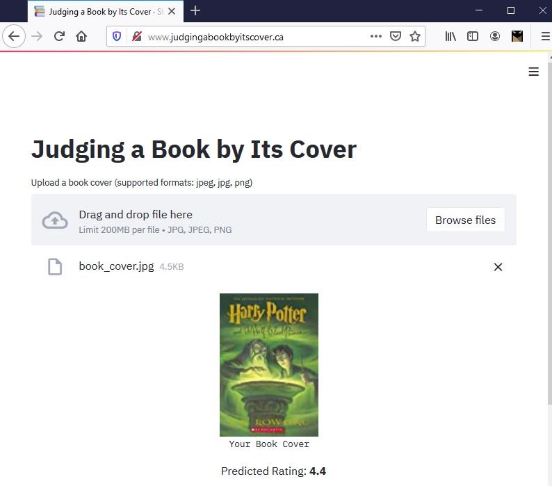
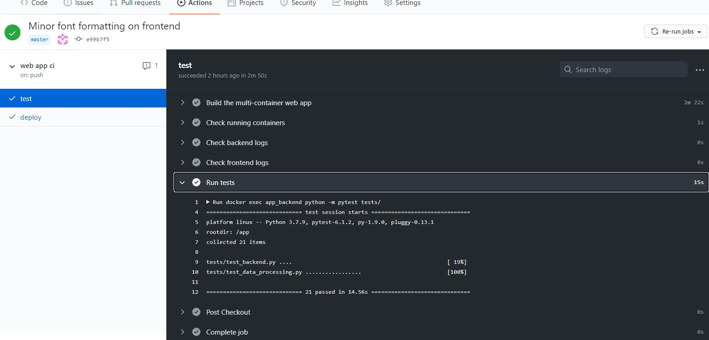
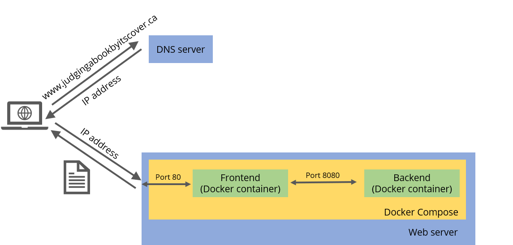

# Judging a Book by Its Cover

Judging a Book by Its Cover is a web app that predicts the rating for a book based on its cover image. To see it in action, visit the [website](http://www.judgingabookbyitscover.ca/).

## Details of the Web App

The training data (average user rating and book cover images) is obtained from about 15,000 books from Goodreads with at least 10 reviews (using the [goodreads Python package](https://pypi.org/project/Goodreads/)). The underlying model uses features extracted from the [ResNet18](https://arxiv.org/abs/1512.03385) model pre-trained on ImageNet data, except the last fully connected layer was modified for the regression task at hand.

The app is split into the frontend and backend modules. The backend is built with [FastAPI](https://fastapi.tiangolo.com/), a relatively new and high-performing Python web framework, and handles the data processing and model scoring. The frontend is built using [Streamlit](https://www.streamlit.io/), a convenient and opinionated library for building single-page interactive web applications that is great for prototyping.

## Details on Deployment

To make the app more easily reproducible for deployment, I used [`Docker`](https://www.docker.com/blog/containerized-python-development-part-1/) to containerize the frontend and backend components, and used [`Docker Compose`](https://docs.docker.com/compose/) to orchestrate the two containers.

To host the web app, I purchased a domain and rented a Ubuntu server from [Vultr](https://www.vultr.com/products/cloud-compute/). It was fairly simple to set up Docker on the compute instance via `apt get`, and I was able to get the app up and running in no time. I followed [this tutorial](https://gethelp.wildapricot.com/en/articles/546-godaddy-dns-setup) for the DNS setup. 

To automate the deployment process, I decided to go with [GitHub Actions](https://github.com/features/actions). The workflow I set up would first build the multi-container app and run my backend tests to make sure the endpoints work as expected and that the predictions are served with sufficiently low latency. Next, it would connect to the remote server using SSH, pull the changes from the repository, rebuild the images and restart the containers. A lot of the inspiration came from [this helpful tutorial](https://soshace.com/deploying-your-nodejs-code-to-a-server-every-time-you-push-with-github-actions/). The whole process only takes a few minutes to complete (most of which is spent on building the Docker images during the test stage), and allows me to make sure that I haven't introduced any code breaking changes, as shown below: 

And to summarize, the diagram below illustrates the architecture of the app.

## Learnings 📚

Through this project, I had a chance to review the [documentation](https://docs.docker.com/compose/compose-file/) on Docker Compose and learn more about the tool. I also got to use GitHub Actions to automate the CI/CD process. It was also an interesting experience purchasing a domain for the first time, and very satisfying to see my own web app live on the Internet 👩‍💻!
  
## Some Next Steps
1. Work on improving the model: I can try fine-tuning the whole model on my book cover image dataset instead of using fixed weights from the pre-trained model, apply a deeper ResNet model or use a different architecture (e.g. [ResNeXt](https://arxiv.org/abs/1611.05431)). I did not spend too much time on model refinement yet because I wanted to focus on getting the app up and running to learn about the deployment process.
2. Convert the site from HTTP to HTTPS by obtaining and configuring an SSL certificate.
3. Learn more about reverse proxies like `nginx`.
